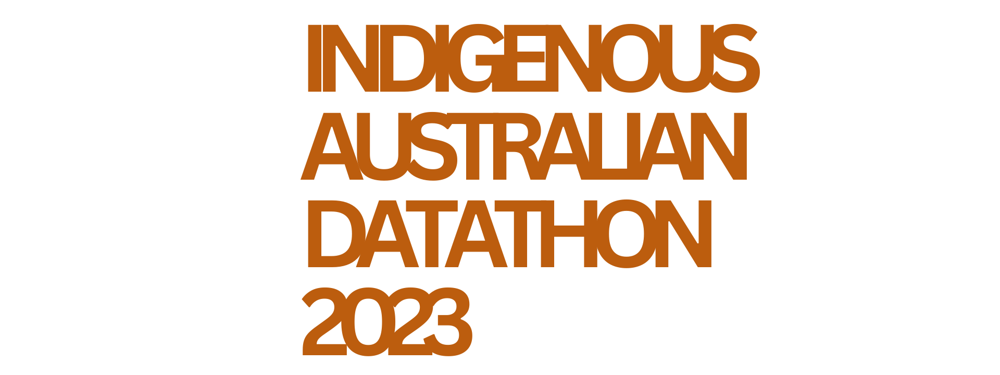

    

 

Welcome to the Indigenous Australian Datathon 2023. We will be working together to solve community challenges and coming up with solutions together as a team. This event will educate and train participants in handling data and developing tools that solve real world problems. It's a great way to bring indigenous communities with technical experts and form connections that will endure long after the event is over.

This year we will see teams work on problems in the following themes.
- Health
- Rock Art
- Agriculture: Animal Management
- Agriculture: Erosion
- Agriculture: Fauna Identification
- Emergency Management - Search and Rescue

Here you'll be able to find guidence for:
- [Datasets](datasets.md)
- [Sign In](sign-in.md)
- [SageMaker](sagemaker.md)
- [S3](s3.md)

If you get stuck or need more assistance feel free to reach out to our tech experts. 