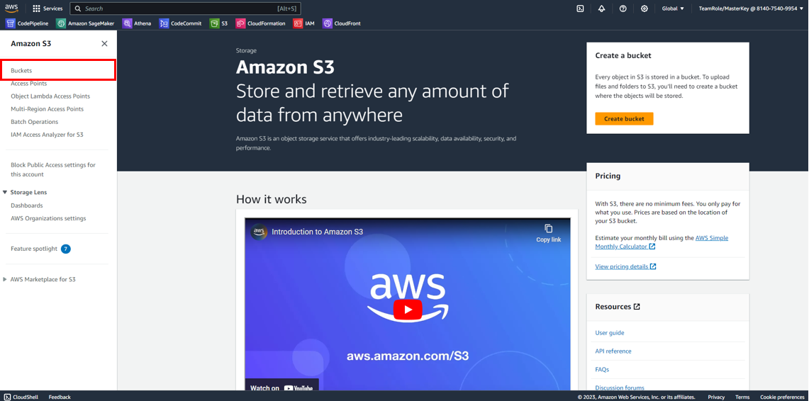

# S3

S3 is an Amazon Web Service that we will be using for this event to store the data we'll be working with. Access to these datasets will be provided to your teams via a place holder link.

Refer to [Datasets](datasets.md) for the list of datasets with their associated link.

If you have brought some of your own data that you would like to work with then here are couple of simple steps to help you get it into an S3 bucket.

**Step 1** 
Search for "S3" in the AWS console 

**Step 2** 
Open the left widget select buckets 

**Step 3** 
Select Create bucket 

**Step 4** 
Name your bucket, here we are using lot-of-data-bucket as our name, be sure to follow the [rules for naming buckets](https://docs.aws.amazon.com/AmazonS3/latest/userguide/bucketnamingrules.html?icmpid=docs_amazons3_console). 

Leave the remaining default values and select "Create bucket" 

**Step 5** 
Now it's time to upload data to our bucket. First click on the name of the bucket. 
 
Let's create a folder first to store the data in, select "Create Folder". . 
 
Remember to follow these [rules](https://docs.aws.amazon.com/AmazonS3/latest/userguide/object-keys.html?icmpid=docs_amazons3_console) when naming your folder. In this case we are calling the new folder: "KoalaData". Once done, select "Create Folder at the bottom".

**Step 6** 
Now that our folder is created, click on the folder name. 
 

**Step 7** 
Select either upload button. 
 
Drag and drop your files onto the webpage and then press "Upload" 
 
After your files have successfully uploaded, you will see this on your screen. Select "Close"
 
Now you should be able to see your data in your bucket.

Refer to the [SageMaker](sagemaker.md) tutorial on how to move this onto a notebook instance if required.

