# SageMaker
Amazon SageMaker is a fully managed development environment, specifically tailored for machine learning. Here you can easily develop and test code/ML models to help solve your problem.

If you're new to AWS and SageMaker, below are a couple of steps to get you on your feet. You should only need one notebook instance for your team.

**Step 1** 
Search for "SageMaker" in the AWS Console  
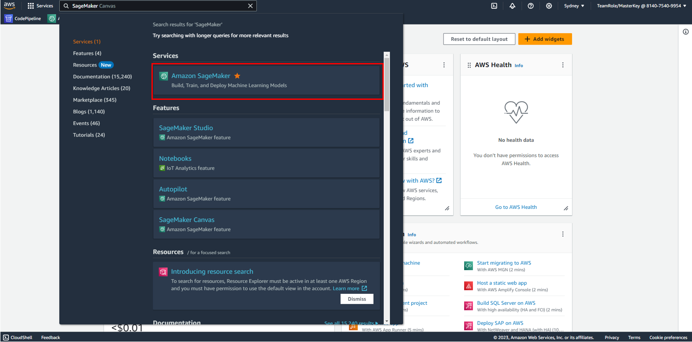

**Step 2** 
On the left, select the drop down “Notebook” and then select “Notebook instances”. 
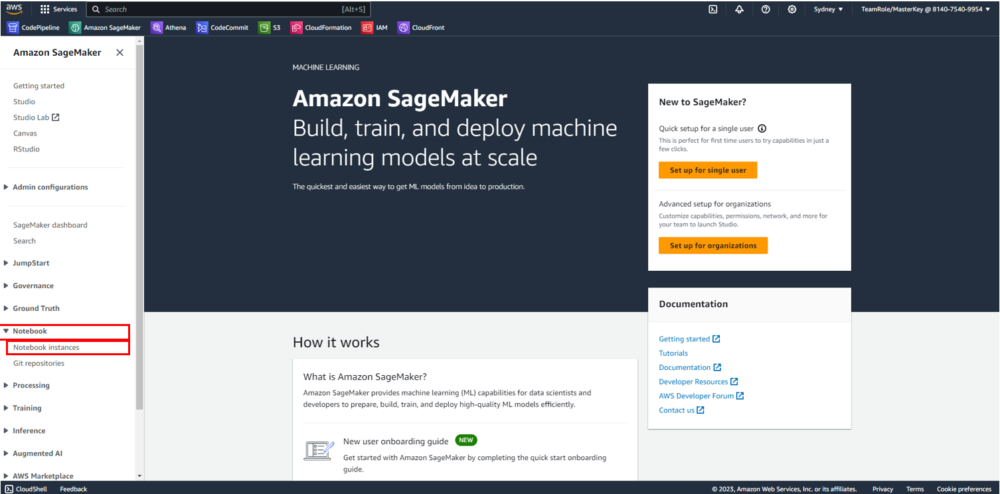

**Step 3** 
To create a new notebook instance, select “Create notebook instance” 
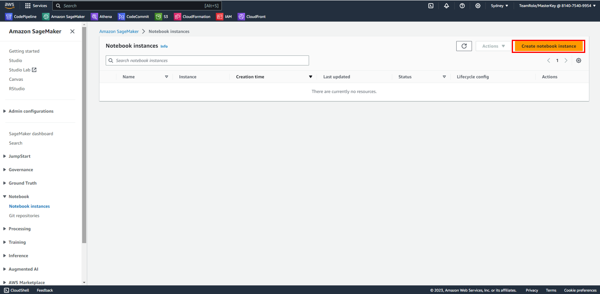

**Step 4** 
Create a name for your notebook. If not selected already, select “ml.t3.medium” and “Amazon Linux 2, Jupyter Lab 3” in the Notebook instance settings pane. 
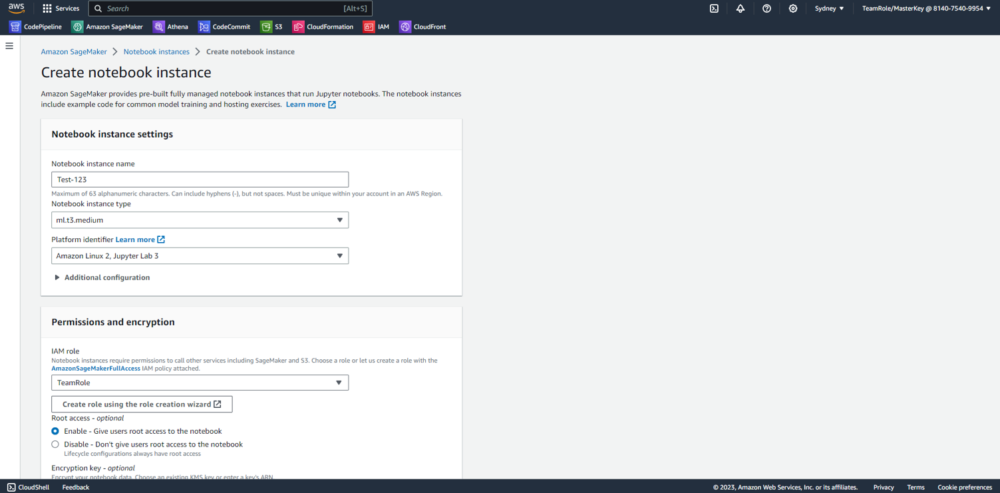 
Leave the remaining default entries and select “Create notebook instance” at the bottom of the page 
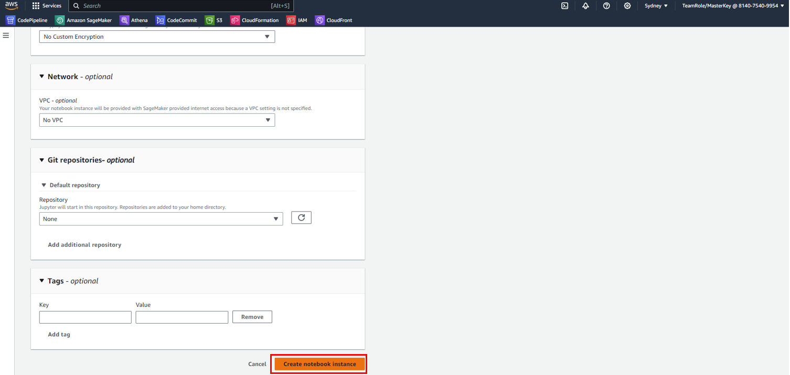 
Once clicked, you will now see your new notebook instance. The status will be initially “Pending”, give it a couple of moments and wait for it to say “InService”.
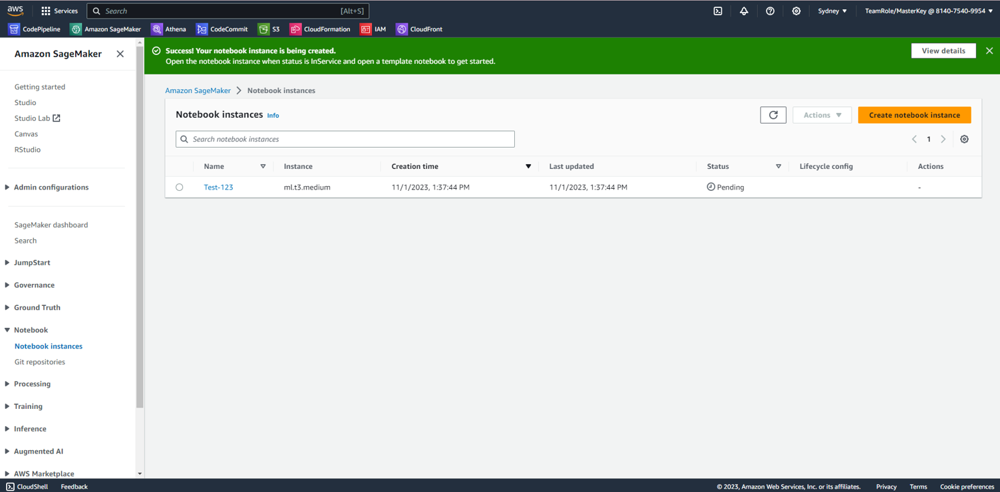

**Step 5** 
When the status has changed from “Pending” to “InService” select “Open JupyterLab” 
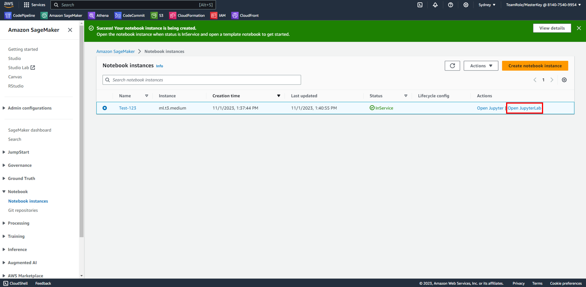 
Once launched, your screen should look something like below, for next step select the terminal option 
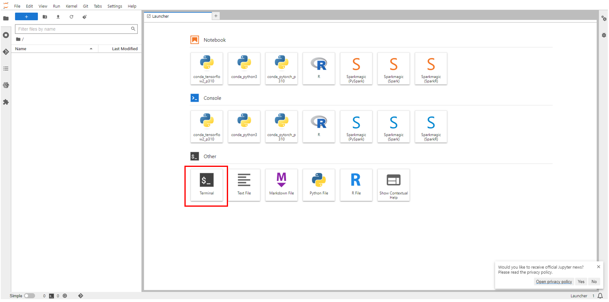 

**Step 6** 
In order to download our data onto our notebook instance, we need to information from our S3 bucket first to tell our instance where to pull the data from. 
To do this, navigate to the folder your data is stored in S3 (if you are uploading data to S3, see the instructions in S3 on how to upload your data). 
In the example below, I've created a bucket called lot-of-data-bucket with a folder called "KoalaData" which stores images of koalas I want to use in our notebook instance. 
To Copy this data int our notebook instance, we need to get the S3 URI of the folder that holds all our data. Firstly, select the folder you want to copy, then select "Copy S3 URI". 
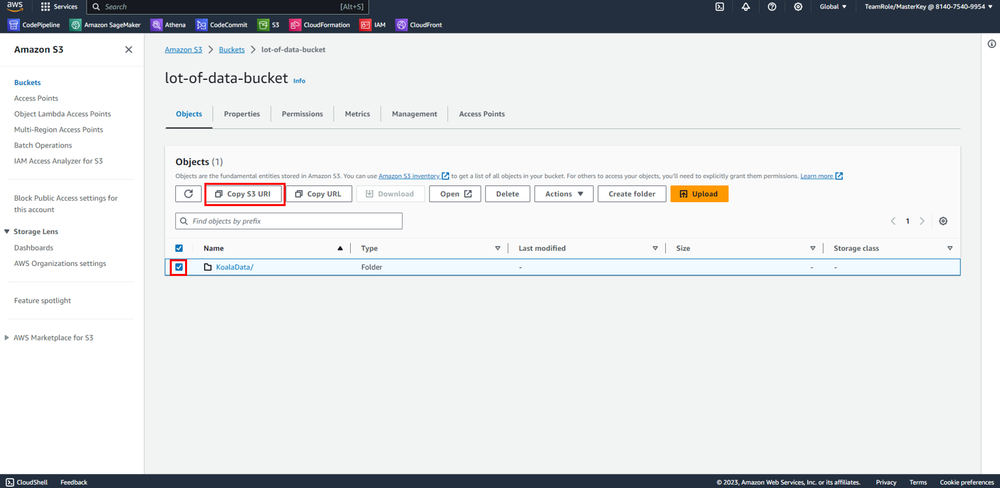 

**Step 7** 
Now we can return to our notebook instance. To keep our data organised, let's create a corresponding folder in our instance called "KoalaData" which we shall copy our data to. This can be done by selecting the add folder icon. 
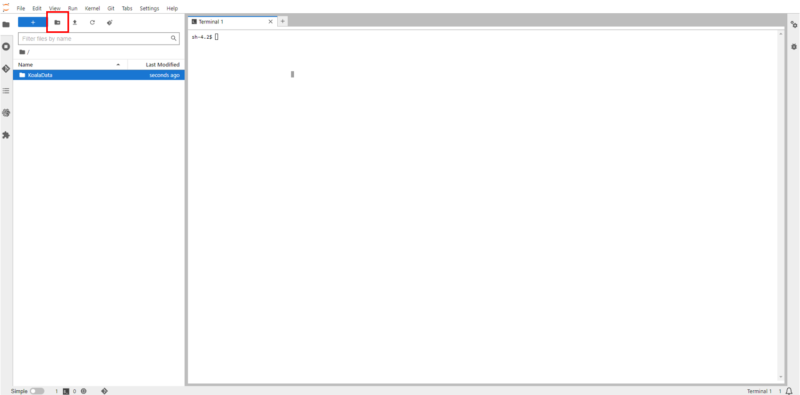 

**Step 8** 
Now, we can start downloading data through the terminal. Firstly, let's navigate to where the Koala folder is stored. To this, type the following command: "cd SageMaker".

To copy the data, we can use the following command: "aws s3 cp s3://lot-of-data-bucket/KoalaData/ ./KoalaData –recursive". Let's break this command down so you understand it better.
* <u>aws s3</u> means that we are accessing the s3 service of aws
* <u>cp</u> is a command to tell the terminal to copy our data
* <u>s3://lot-of-data-bucket/KoalaData/</u> is the source folder we are copying from. ***Place your S3 bucket URI here***.
* <u>./KoalaData</u> is the destination folder we are copying to. ***Place the name of your destination folder here***.
* <u>--recersive</u> means to copy everything within our source folder.

Below is an example of what step 8 looks like through the terminal 
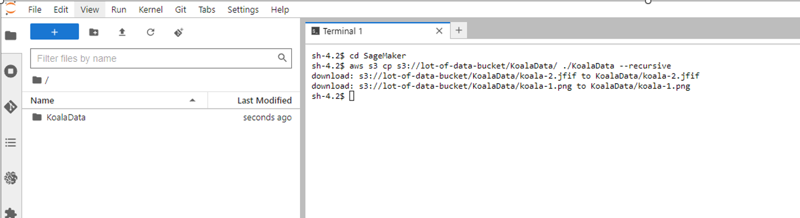 
Now you can navigate to your destination folder and should find your images have been successfully copied into there.
