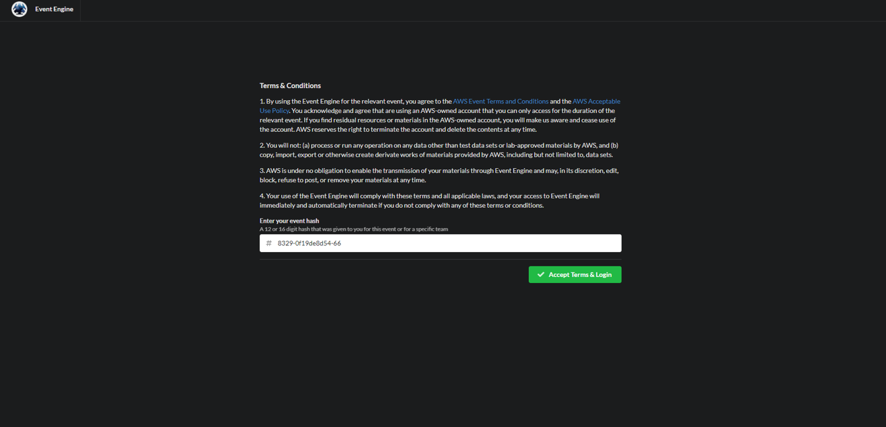
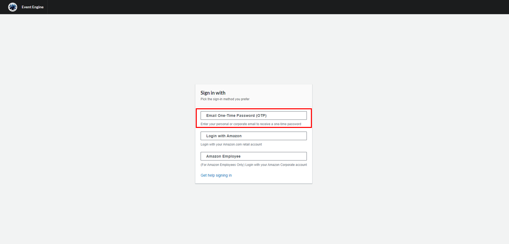
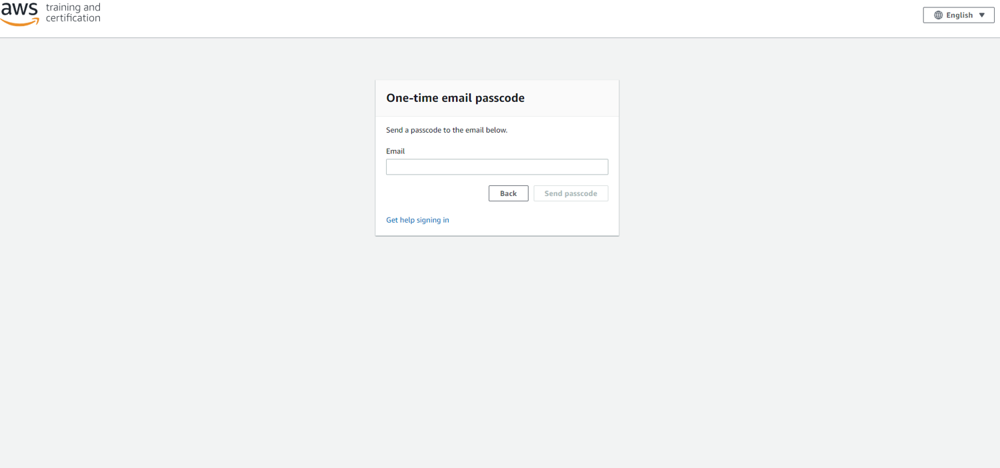
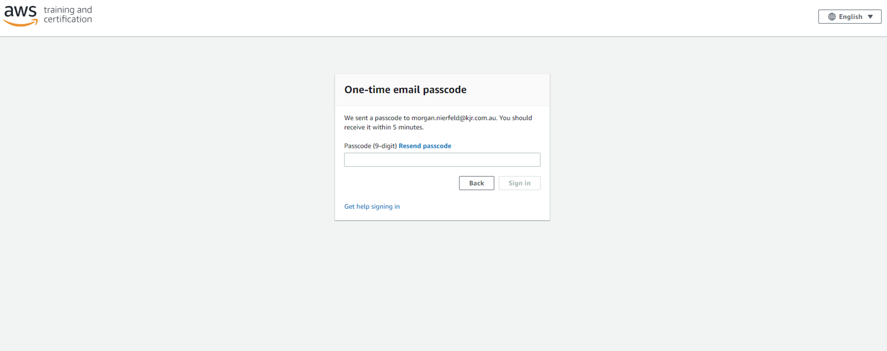
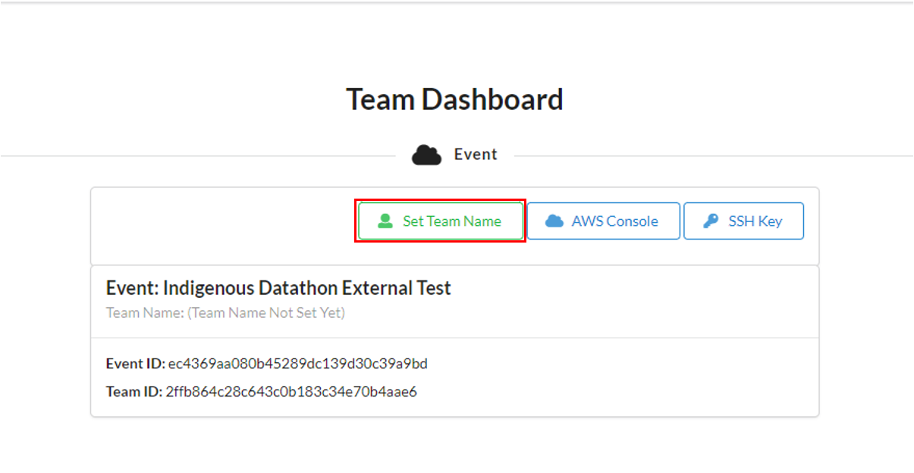
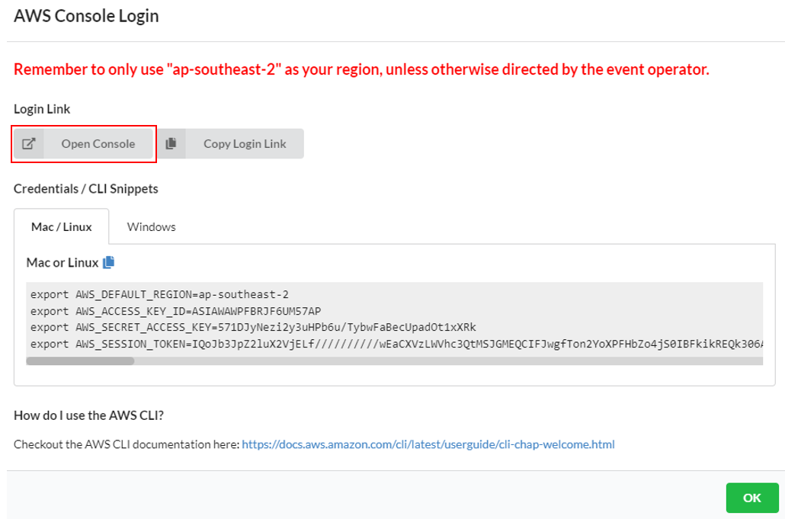
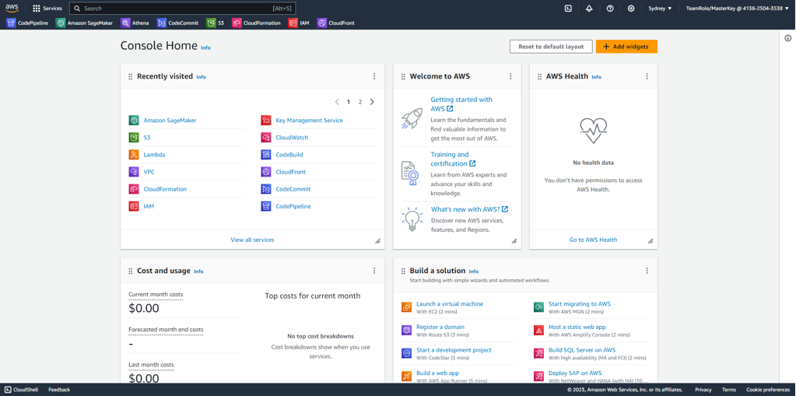

# Signing In
Sign in to the AWS account will be done through your own email utilising a one time password.

Follow the steps below if you need some guidance with this.

**Step 1** 
Enter the hash-code given to you 

**Step 2** 
Select: "Email One-Time Password (OTP)" 

**Step 3** 
Enter your email address and select "Send passcode" 

**Step 4** 
Enter the one-time password sent to your email and select "Sign In" 

**Step 5** 
Once log in is successful, your page should look like this: 

Once you're team has decided on a name, select "Set Team Name" and enter your team name.

**Step 6** 
To access the AWS console select "Open Console" taking note of the message at the top in red! 

**Step 7** 
Once loaded, your AWS landing page should look similar to this:

